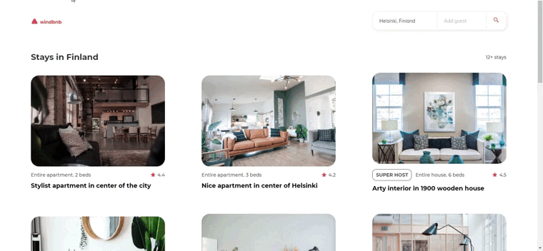

<h1  align="center">Windbnb</h1>

Solution for a challenge from <a  href="http://devchallenges.io"  target="_blank">Devchallenges.io</a>.

<h3>
<a  href="https://windbnb-yv.netlify.app/">Demo</a>
 | 
<a  href="https://devchallenges.io/solutions/VJmFnaO3pVeypHQ1Atly">Solution</a>
 | 
<a  href="https://devchallenges.io/challenges/3JFYedSOZqAxYuOCNmYD">Challenge</a>
</h3>

## Table of Contents
-  [Overview](#overview)
-  [The Challenge](#the-challenge)
-  [Built With](#built-with)
-  [Contact](#contact)

  
## Overview

## The Challenge
> Challenge: Create a small version of Airbnb - Windbnb with given data. Use Front-end libraries like React or Vue. Don’t look at the existing >> solution. Fulfill user stories below:
> 
> User story: I can see a list of properties
> User story: I can see the property card with a name, rating, apartment type, and super host
> User story: I can open the filter drawer
> User story: I can filter properties by location and number of guests
> User story: I can see the number of filtered items
> User story: I can see pages following given designs
> Icon: https://google.github.io/material-design-icons/

### Built With
-  React
- Webpack

## Contact
- GitHub [@Yaiza16](https://github.com/yaiza16)

